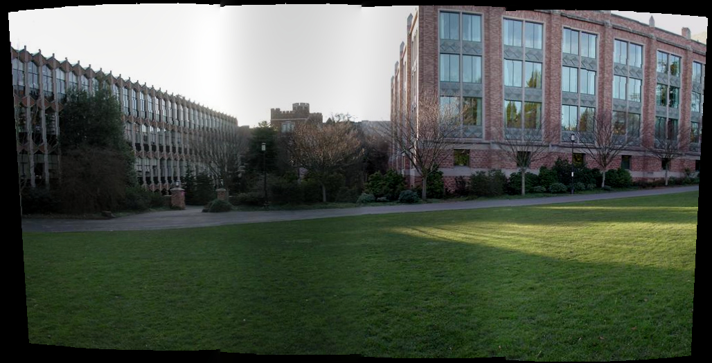

## Ex6：全景图像拼接

<h4 class="right">14331098 黄建武 计应</h4>
- 实验环境
    - Linux Deepin 15.3
    - g++ 6.2.0
    - C++11
- 第三方库
    - CImg
    - vlfeat
- 参考资料
    - [柱面投影](http://blog.csdn.net/weixinhum/article/details/50611750)
    - [用VLFeat库进行SIFT特征提取（C++ 实现）](http://blog.csdn.net/lilai619/article/details/50571267)
    - [SIFT特征提取分析](http://blog.csdn.net/abcjennifer/article/details/7639681/)
    - [图像融合算法(归纳篇)](http://blog.csdn.net/songzitea/article/details/24851173)
    - [ImageStitching](https://github.com/AmazingZhen/ImageStitching)

- 运行说明
    - `make` 进行编译
    - `make run` 运行程序
    - 结果图像保存于`result`文件夹中
- 实验要求

输入图像是一系列图片，对输入的图像进行全景图像拼接。

- 实验方法
    - 对输入的图像分别进行柱面投影

    由于摄像头的朝向不同，重合部分图像中的物体并不满足视觉一致性的要求，因此需要将图像进行投影，使其满足图像的一致性要求，为后面的拼接做准备，一般选择柱面投影算法，将图像分别投影到以 像素焦距+摄像头与圆心距离 为半径的圆柱上。投影后的图像为上图摄像头前方的圆弧。从圆弧上看，图像的重合部分已经满足视觉一致性的要求，可以做拼接。
    具体的推到过程可参见博客[图像柱面投影算法](http://blog.csdn.net/weixinhum/article/details/50611750)，最后的柱面投影公式如下，其中R为柱面的半径，W和H分别为图像的宽和高，x，y为原图像中像素的坐标，x'，y'为投影图像中像素的坐标：
    $$k=\frac{R}{\sqrt{R^2+x^2}}$$
    $$x=\frac{x'-{\frac{W}{2}}}{k}+\frac{W}{2}$$
    $$y=\frac{y'-{\frac{H}{2}}}{k}+\frac{H}{2}$$
    由于投影后的图像点坐标未必为整数，而图像的坐标需要为整数，所以必将造成误差，投影后的图像有很多毛刺，需要进行双线性插值。

    - 使用第三方库`vlfeat`提取SIFT特征

    SIFT算法是一种提取局部特征的算法,在尺度空间寻找极值点,提取位置,尺度,旋转不变量。SIFT特征是图像的局部特征,其对旋转、尺度缩放、亮度变化保持不变性,对视角变化、仿射变换、噪声也保持一定程度的稳定性。具体原理参见博客[SIFT特征提取分析](http://blog.csdn.net/abcjennifer/article/details/7639681/)

    - 利用k-d树进行特征匹配，得到特征匹配对

    特征点匹配实际上就是一个通过距离函数在高维矢量之间进行相似性检索的问题。K近邻查询是给定查询点及正整数K，从数据集中找到距离查询点最近的K个数据，其基本思想就是对搜索空间进行层次划分。

    - 匹配提取，得到鲁棒的特征匹配对，利用RANSAC算法筛选匹配点并计算变换矩阵

    RANSAC算法的输入是一组观测数据（往往含有较大的噪声或无效点），一个用于解释观测数据的参数化模型以及一些可信的参数。RANSAC通过反复选择数据中的一组随机子集来达成目标。被选取的子集被假设为局内点，并用下述方法进行验证： 

    有一个模型适应于假设的局内点，即所有的未知参数都能从假设的局内点计算得出。
    
    用以上得到的模型去测试所有的其它数据，如果某个点适用于估计的模型，认为它也是局内点。
    
    如果有足够多的点被归类为假设的局内点，那么估计的模型就足够合理。
    
    然后，用所有假设的局内点去重新估计模型（譬如使用最小二乘法），因为它仅仅被初始的假设局内点估计过。
    
    最后，通过估计局内点与模型的错误率来评估模型。
    
    上述过程被重复执行固定的次数，每次产生的模型要么因为局内点太少而被舍弃，要么因为比现有的模型更好而被选用。

    - 图像融合

- 实验结果

数据集1

数据集2

- 实验问题
一开始把图像转为bmp格式再进行拼接，测试集1只有4张图片，运行速度还挺正常的，但是到了测试集2，有18张图像，每张都是6M左右，在拼接的时候非常慢，拼接的越多生成的图像越大，越往后速度越慢，最后18张图像拼接生成的图像总共118M，难怪运行了10几20分钟，于是改用jpg格式，使用jpg图像进行拼接，提高了运行速度。
